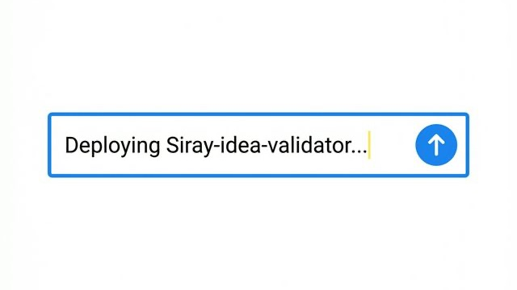
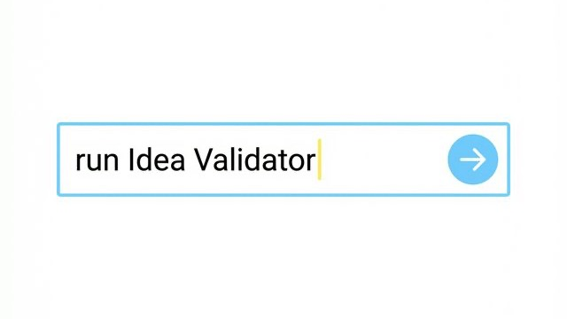
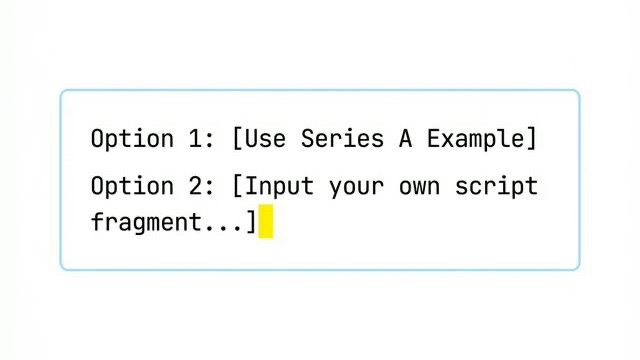
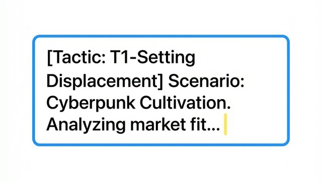
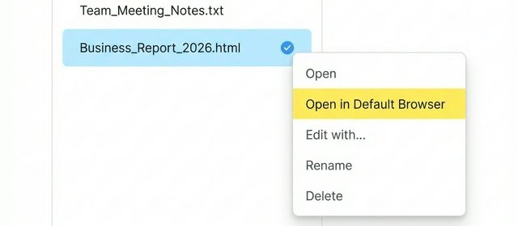
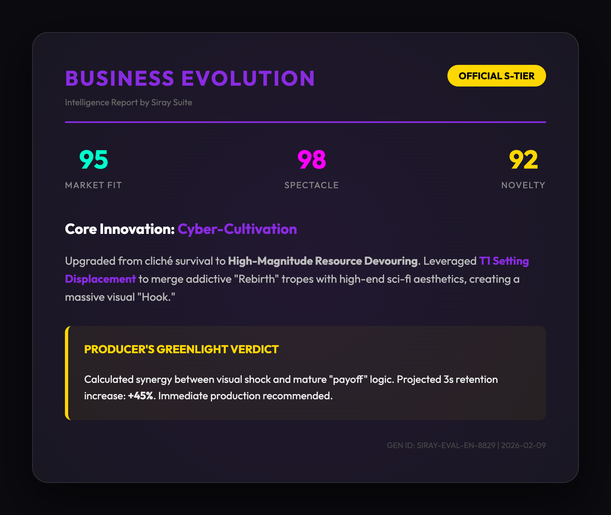

# Siray Idea Evaluator & Optimizer Pro (Comic-Drama Commercial Evaluation & Optimization)

> **Bridge the gap between "Random Inspiration" and "Million-View Comic-Drama Script" in seconds.**

---

## 🎯 Why do you need Siray Skills | Idea Evaluator & Optimizer?

In the AI Comic-Drama track, what determines views isn't "writing style," but **"Commercial Addictive Indicators."**

**Siray Skills Exclusive Advantages**:
- **One Key, All Models**: Built-in **Siray API** routing. With one single key, you can simultaneously orchestrate **Claude 4.5 Thinking (Best Overseas Creativity)** and **DeepSeek V3.2 (Best Domestic Logic)** for true cross-border, multi-platform model synergy.
- **Hybrid Cloud Evaluation**: Leverages the differentiated strengths of various models in linguistic understanding and logical deduction to provide a more objective and sharper commercial audit than any single model.

Pain points of traditional scriptwriting:
- **Subjective Evaluation**: Writing by "feel" without knowing if it hits the platform's algorithm-recommended trends.
- **Visual Stagnation**: Beautiful words that lack conflict when converted to AI images, resulting in low completion rates.
- **Innovation Hurdles**: Knowing a theme is cliché but not knowing how to perform "Setting Displacement" or "Reverse Upgrades" at key junctions.

**Siray Idea Evaluator & Optimizer** is designed to solve these by providing a dual-engine workflow: **Strict Commercial Evaluation** to identify flaws and **Deep Narrative Optimization** to inject commercial value. It integrates the official Siray Skills track strategy guide, serving as your "Chief Architect Assistant" before any script rollout.

---

## 📥 Quick Start (5-Step Workflow)

> **Welcome to the elite rank of Siray Skills Creators. Let's begin the commercial evolution of your script.**

### Step 1: Rapid Deployment
1. **Command Deployment**: Type the following in your IDE Agent (Antigravity / Cursor / Windsurf):
   > "Help me deploy this Skill: `https://github.com/______`"
2. **Connect to Siray Universe**: During deployment, the system will guide you. Use your **Siray API Key** as the ultimate gateway to instantly unlock global hybrid-cloud model orchestration.
   * **Get Key**: Login to [Siray.ai](https://www.siray.ai/) -> Click Profile -> **API Keys**.
   * *✨ Siray Skills Edge: One key to drive the literary soul of Claude 4.5 and the hardcore logic of DeepSeek.*

### Step 2: One-Key Activation
Start the expert directly as if talking to a real assistant:
* **Recommended: Natural Language**: Type **"Run Idea Validator"** or **"Launch Comic-Drama Evaluation Expert"**.
* **Alternatives** (Note: varies by IDE environment):
  * **Slash Command**: `/idea-validator-pro`
  * **@ Mention**: `@SKILL.md` followed by your inspiration.

### Step 3: Hard Logic Audit (Assessment)
1. **Input Material**: Send your inspiration, rough script, or outline. 
2. **Commercial Scan**: Experience the rigor of **DeepSeek V3.2** under the Siray instruction framework, scanning for "Market Fit, Visual Spectacle, and Concept Novelty."
3. **Reference Benchmarking**: Reply "Use Series A example" to see how the system evaluates an official perfect template.

### Step 4: Creative Soul Fission (Optimization)
Once the audit is complete, the system doesn't just leave you with problems. **Claude 4.5 Thinking** will activate built-in **T1-T5 Top Tactics** to perform "Structural Surgery" on your script, transforming flat narratives into "Commercial Hooks" that instantly spike script value.

### Step 5: Automated Reporting — [Siray Skills Signature Aesthetic]
Without extra confirmation, the system generates dual-format reports in `./output/` reflecting Siray's minimalist aesthetic:
* **Markdown Archive**: Holds the deep logical derivation, perfect for project review.
* **Premium HTML Card**: The visual business card of Siray Skills. High-aesthetic "Commercial Passport" with full data visualization.
  * **💡 How to View?**
    1. Locate `output` folder in the sidebar.
    2. Right-click the `.html` file.
    3. Select **"Open in Default Browser"**.
    4. Screenshot and share the professional report immediately.

#### ✨ Real-world Output Example (English Suite)

This is one of the standard outputs generated by the validator, showcasing the high-aesthetic commercial audit results:

---

## ✨ Strategic Demos (Series A-E)

We have pre-configured 5 high-value example scripts based on the **Siray Skills Series A-E** core tracks:

| Identifier   | Track Name            | Strategy Focus                      | Typical Payoff                           |
| :----------- | :-------------------- | :---------------------------------- | :--------------------------------------- |
| **Series A** | **Wasteland**         | Extreme safety & resource gathering | Material hoarding, survival reversal     |
| **Series B** | **Anomaly Rules**     | Uncanny Valley & rule-solving       | Adrenaline rush from puzzle exit         |
| **Series C** | **Eastern Fantasy**   | Visual Equality & Mech-Cultivation  | Violent aesthetics of Rune-powered Mechs |
| **Series D** | **Historic Intrigue** | Regret fixing & God-view spoilers   | Industrial Revolution in ancient times   |
| **Series E** | **Urban Revenge**     | Class crossing & emotional proxy    | Audience gasps at secret identity reveal |

---

## 🚀 Why Siray Idea Evaluator & Optimizer?

---

## ⚔️ Understanding the T1-T5 Innovation Tactics

For those new to the Siray framework, the **T1-T5 Tactics** are specialized "Commercial Surgery" tools used to optimize scripts:

- **T1: Setting Displacement**: Swapping standard characters into alien/high-contrast environments to create instant curiosity.
- **T2: Scale Multiplier**: Upgrading the magnitude of events (from a "fight" to a "world-shattering duel") to maximize visual impact.
- **T3: Rule Reversal**: Subverting audience expectations by flipping moral or logical rules (e.g., the "Hero" is the cause of the disaster).
- **T4: Visual First**: Designing scenes that are surreal or hyper-visual, specifically optimized for AI video/image generation.
- **T5: Proxy Catharsis**: Identifying social frustrations and providing a high-impact emotional payoff to drive audience addiction.

---

## 🚀 Why Siray Idea Evaluator & Optimizer?

| Dimension         | Normal AI (ChatGPT/Claude)   | Siray Idea Validator ✅                |
| :---------------- | :--------------------------- | :------------------------------------ |
| **Granularity**   | Vague literary feedback      | **Based on official scoring_rubric**  |
| **Depth**         | Lacks commercial orientation | **Integrated Series A-E logic**       |
| **Innovation**    | Random brainstorming         | **T1-T5 targeted tactics**            |
| **Collaboration** | Single model reply           | **DeepSeek + Claude dual-engine**     |
| **Delivery**      | Plain text / Simple MD       | **MD + Premium GUI Evolution Report** |

---

## 📂 Project Structure

- `references/`: Core Intel (Scoring Rubric, Innovation Tactics)
- `examples/`: Track Showrooms (Series A-E official examples)
- `scripts/`: Logical Execution Engine
- `output/`: Evaluation report output

---

**Powered by Siray Skills Suite**
